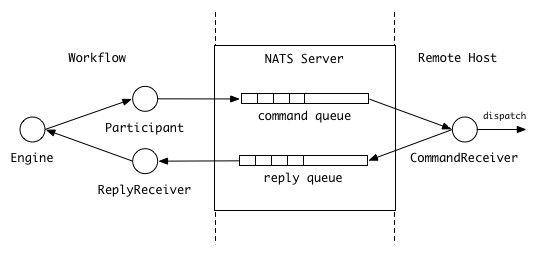

# ruote-nats

ruote-nats is an implementation of the ruote participant and receivers to process workitem on remote host using NATS.



## Usage

Participant registration:

```ruby
engine.register_participant :remote_shell, RuoteNATS::Participant
```

Process definition:

```ruby
remote_shell :command => '/bin/date', :env => { 'LANG' => 'C' }
```

### Options

* ```queue```: subject to publish command name, the default value is "remote.command".
* ```executor```: executor to dispatch on remote host, the default value is "RuoteNATS::ShellExecutor".

### Options for ShellExecutor

* ```command```: (required) shell script.
* ```env```: environments variables for command.

## Single File Example

```ruby
require 'bundler/setup'

require 'ruote'
require 'ruote-nats'

RuoteNATS.logger.level = Logger::DEBUG

NATS.start do
  begin
    pdef = Ruote.define do
      remote_shell :command => '/bin/date', :env => { 'LANG' => 'C' }
    end

    engine = Ruote::Engine.new(Ruote::Worker.new(Ruote::HashStorage.new))
    engine.register_participant :remote_shell, RuoteNATS::Participant

    RuoteNATS::CommandReceiver.new.start
    RuoteNATS::ReplyReceiver.new(engine).start

    engine.launch(pdef)

    EM.add_timer(1) do
      NATS.stop
    end
  rescue
    Logger.new(STDOUT).error($!.message)
  end
end
```
